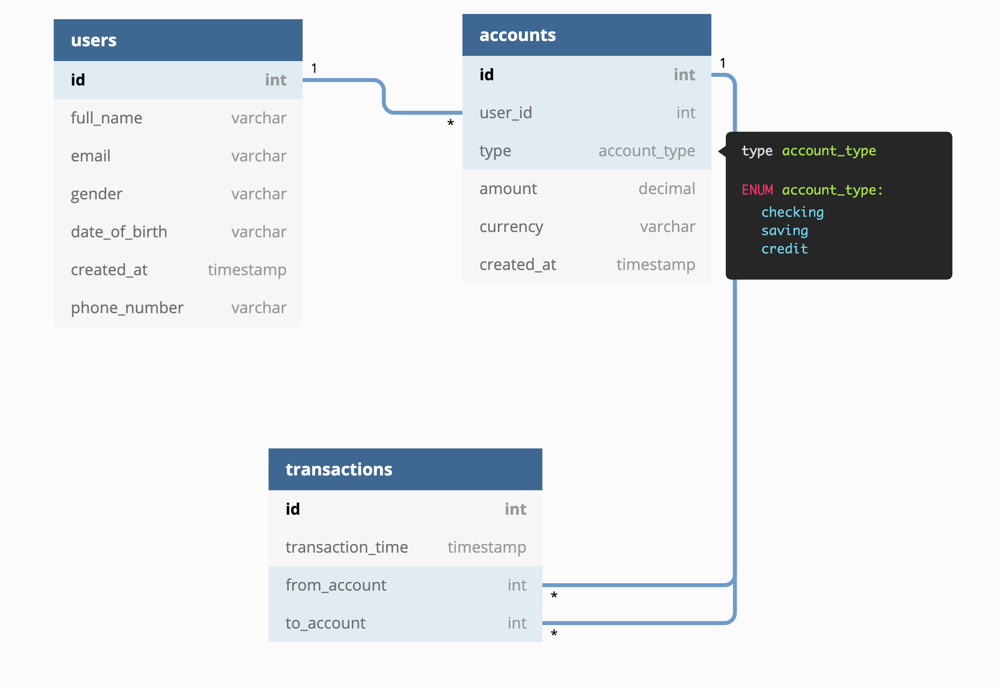
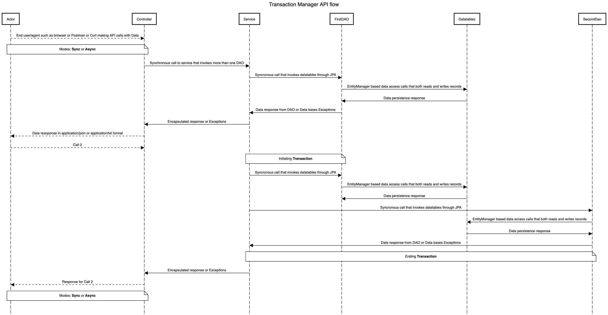
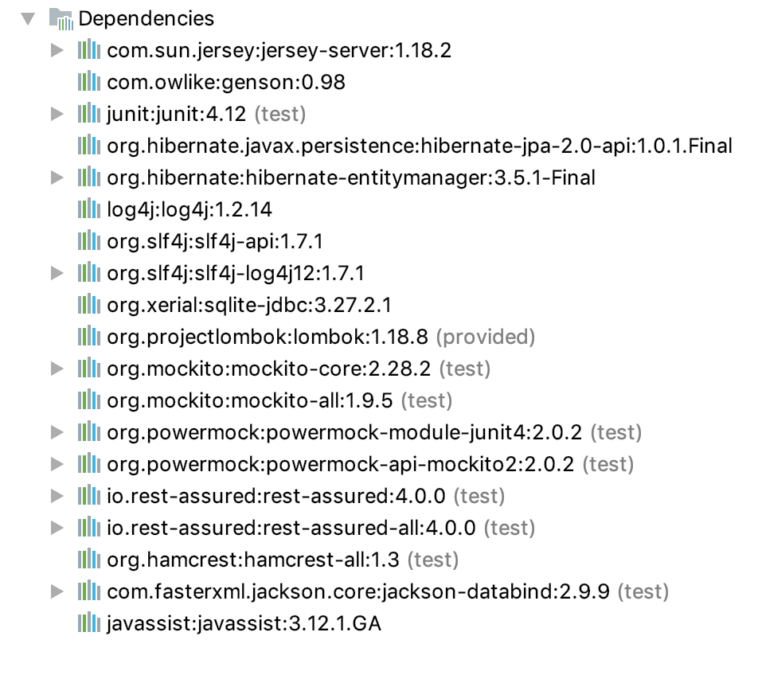

# transaction-manager

* [Context](#context)
* [Objectives](#objectives)
* [Approach](#the-approach)
* [Schema](#schema)
* [API System](#api-system-flow)
* [API Flows](#api-flows)
* [TDD-Red->Green->Refactor cycle](#tdd---red->green->refactor-cycle)
* [Setup](#setup-and-launch)
* [Libraries Used](#libraries-used)
* [Challenges](#challenges)
* [References](#references)

## Context
A Small, light-weight Rest API based Java application without any framework, which does not require any server.

## Objectives
Following are the primary objectives this project is based on
1. The REST API should be built on an embedded server which means there should be no server or container that helps these API end points run at a particular application endpoint
2. TDD should be enforced at every stage of the implementation
3. The Application implementation should be simple and scalable as if it has real time traffic with multiple users accessing the system simultaneously
4. The Application is meant to be Light weight hence Heavy frameworks such as Spring could not considered while implementing
5. Application could only rely on in memory datastores

## The Approach
Based on the aforementioned objectives the system that is being built has been built based on the following approach:
- Using Jersey-Server library to create a JAX-RS reliant REST API server which can run as a self contained, embedded server that can be started and stopped from a simple Java application.
- Using Mockito and PowerMocktio frameworks the entire implementation is developed following the TDD strategy where fail tests -> refactor -> pass tests cycle was strictly carried on.
- JAX-RS application are simple, fast, reliable at the same time scaled based on the underlying data access implementations
- SQLite datastore is used to store the data without involving any sever runtime or containers to actively engage with data connections.
- Hibernate-JPA library is used to leverage the advantages javax.persistence library which helps in efficient, simple and scaled database access approaches.


## Schema


## API System flow



## API Flows
### Endpoint info
| Endpoint\HTTP METHOD | POST            | GET       |
| ----------- | --------------- | --------- |
| CRUD OP                               | CREATE                                | READ                                                              | 
| /users                                | Create new User                       | List existing users                                               |
| /users/1                              | --                                    | Show Existing user                                                |
| /users/1/accounts                     | Create an account for user1           | List All Accounts of user 1                                       |
| /users/1/accounts/1                   | --                                    | Show Existing User's Chosen Account                               |
| /users/1/accounts/1/transactions      | Post a transaction to the given account - payload varies           | Show Selected Account transactions   |
| /users/1/accounts/1/transactions/1    | --                                    | Show Chosen Transaction detail                                    |

### Response Status Codes
Following are the response status codes that are sent as part of the system
* 200 - OK
* 304 - Not Modified
* 400 - Bad Request
* 404 - Not Found
* 500 - Internal Server Error

| Endpoint | Applicable status codes| 
| ----------- | --------------- |
| /users                                | 200, 304, 500           |
| /users/1                              | 200, 404                |
| /users/1/accounts                     | 200, 400, 500           |
| /users/1/accounts/1                   | 200, 400, 404           |
| /users/1/accounts/1/transactions      | 200, 400, 404, 500      |
| /users/1/accounts/1/transactions/1    | 200, 304, 400, 404, 500,|

### Error handling
All the internal errors including runtime errors are handled at controller and sent as a valid response to user following is an example
```bash
curl -d '{"accountNumber" : "2321342SFDS12","accountType" : "SAVINGS","currency" : "USD","balance" : 123.456}' -H "Content-Type: application/json" -X POST http://localhost:8080/users/1/accounts
```
``
HTTP STATUS: 304
``
```javascript
{
    "message": "Record Creation Failed!"
}
```


## TDD - Red->Green->Refactor cycle


## Setup and launch

### installing the packages
With Tests: 
```bash
$ mvn clean install -U
```

### running tests
Unit tests: 
```bash
$ mvn  test
```
Integration tests: 
```bash
$ mvn integration-test
```

### running server
```bash
$ java  com.revolut.assesment.project.server.EmbeddedJettyServer
 ```

## Libraries Used
Following are the Libraries that are used as part of source and test cycles



## Challenges
- Had a lot of challenges in setting up environment first with maven as there was a certificate issue that was messing with my maven commands due to network provider issues
- Had difficulty in choosing the embedded server library as the prime objective was to keep the application light weight
- Initially started with H2 in-memory DB and found out the hard way that it cannot be alive without a server/container or a EJB environment like JBoss.
- Face quite a lot of difficulties when trying to adapt the JAX-RS framework over the jetty-server library provided by sun.net and not glassfish
- Chose SQLite as it was serving the purpose and lightweight but I had to write a lot of initially as I was not able to find any ORM support like JPA adapting to JAX-RS and embedded server format.
- But after spending a lot of time researching I have found a way to make JPA from hibernate support SQLite which let me throw away all my code involving explicit connection handling.
- Had issues trying to setup integration tests, tried glassfish-jersey-client and faced a lot of dependency mismatch issues but finally found the restassured.io that helped me adapt to the sun.net jersey-client library.


## References
- Jersey-Server based Embedded Server supporting JAX-RS: https://dzone.com/articles/lightweight-embedded-java-rest-server-without-a-fr
- Enabling CORS for the Above embedded server approach: https://crunchify.com/what-is-cross-origin-resource-sharing-cors-how-to-add-it-to-your-java-jersey-web-server/
- https://dzone.com/articles/how-i-test-my-java-classes-for-thread-safety
- JAXRS-H2: https://github.com/dprasanthv/JAX-RS-JPA-Hibernate-H2-In-Memory-Database
- JPA-SQlite: https://github.com/juniorware/sqlite-jpa/